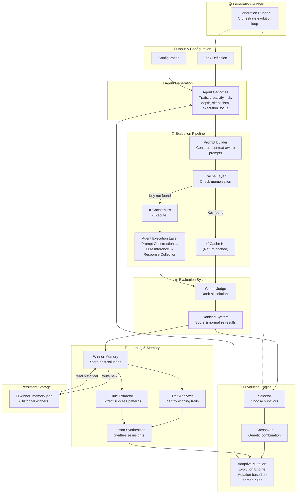
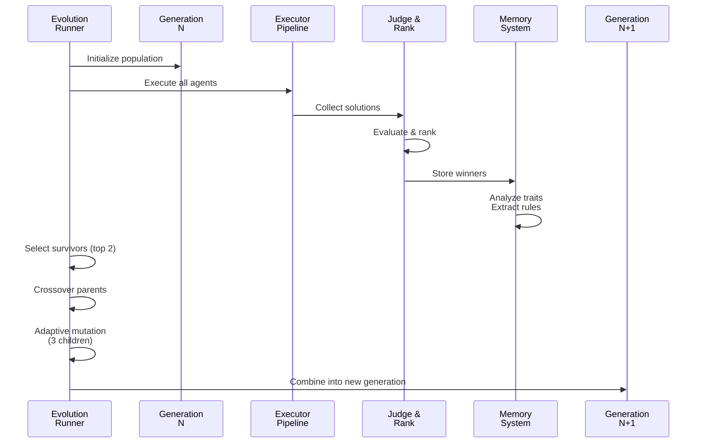

# Agent Darwin - System Architecture

## Overview

Agent Darwin is an evolutionary AI system that generates, evaluates, and improves AI agents through genetic algorithms. The system uses adaptive mutation, memory-driven learning, and intelligent ranking to evolve increasingly better solutions to complex problems.

---

## System Architecture Diagram



---

## Generation Execution Flow (Sequential)

**The complete pipeline for a single generation:**

```mermaid
graph LR
    subgraph Stage1["1️⃣ GENERATION"]
        GEN["🧬 Agent Genomes<br/>(5 agents with<br/>random traits)"]
    end
    
    subgraph Stage2["2️⃣ AGENT EXECUTION LAYER"]
        PC["🎨 Prompt Construction<br/>(Convert traits<br/>→ instructions)"]
        LI["🤖 LLM Inference<br/>(Query LLM API<br/>with prompts)"]
        RC["📨 Response Collection<br/>(Parse & validate<br/>solutions)"]
    end
    
    subgraph Stage3["3️⃣ EVALUATE"]
        JG["🏆 Global Judge<br/>(Multi-criteria<br/>evaluation)"]
        RK["📊 Ranking System<br/>(Normalize scores,<br/>assign ranks)"]
    end
    
    subgraph Stage4["4️⃣ LEARN"]
        WM["💾 Winner Memory<br/>(Store top<br/>solutions)"]
        TA["🔍 Trait Analysis<br/>(Identify winning<br/>trait patterns)"]
        RE["📜 Rule Extraction<br/>(Discover success<br/>patterns)"]
    end
    
    subgraph Stage5["5️⃣ EVOLVE"]
        AA["🎓 Trait Analyzer<br/>(Correlations)"]
        LS["📚 Lesson Synthesis<br/>(Create guidance)"]
        AM["🧬 Adaptive Mutation<br/>(Guided evolution)"]
    end
    
    subgraph Stage6["6️⃣ NEXT GENERATION"]
        SEL["👥 Selector<br/>(Top 2 survivors)"]
        CRO["🔀 Crossover<br/>(Genetic mixing)"]
        MUT["🎲 Mutation<br/>(Trait adjustment)"]
        NEXT["➡️ New Population<br/>(Ready for Gen N+1)"]
    end
    
    GEN -->|"build_agent_prompt()"| PC
    PC -->|"prompt"| LI
    LI -->|"response"| RC
    RC -->|"Solutions"| JG
    JG -->|"rank_solutions()"| RK
    RK -->|"Ranked results"| WM
    WM -->|"Store winners"| TA
    WM -->|"Store winners"| RE
    TA -->|"Trait patterns"| AA
    RE -->|"Rule patterns"| AA
    AA -->|"Correlated traits"| LS
    LS -->|"Mutation guidance"| AM
    RK -->|"Top 2 parents"| SEL
    SEL -->|"Parent 1, 2"| CRO
    CRO -->|"Children"| MUT
    AM -->|"Guided toward<br/>learned optimum"| MUT
    MUT -->|"Mutated children"| NEXT
    NEXT -.->|"Loop to Gen N+1"| GEN
    
    style GEN fill:#e8f4f8
    style PC fill:#fff4e6
    style LI fill:#fff4e6
    style RC fill:#fff4e6
    style JG fill:#f3e5f5
    style RK fill:#f3e5f5
    style WM fill:#e8f5e9
    style TA fill:#e8f5e9
    style RE fill:#e8f5e9
    style AA fill:#fff3e0
    style LS fill:#fff3e0
    style AM fill:#fff3e0
    style SEL fill:#fce4ec
    style CRO fill:#fce4ec
    style MUT fill:#fce4ec
    style NEXT fill:#c8e6c9
```



**Stage Breakdown:**

| Stage | Components | Input | Output | Duration |
|-------|-----------|-------|--------|----------|
| **1. Generation** | Agent Genomes | Population size | N agents with traits | ~10ms |
| **2. Cache & Execute** | Prompt Builder → Cache → Agent Execution Layer | Genomes + Task | Solutions (cached or LLM) | ~0.1-5s per agent |
| **3. Evaluate** | Judge → Ranking | All solutions | Ranked + scored | ~2-3s |
| **4. Learn** | Memory → Analysis | Ranked results | Patterns & rules | ~1-2s |
| **5. Evolve** | Trait Analyzer → Mutation | Patterns | Evolution guidance | ~500ms |
| **6. Next Gen** | Selector → Crossover → Mutation | Parents + guidance | N new agents | ~100ms |
| **Total per Generation** | All stages | Initial population | Ready for Gen N+1 | **~6-10s** |

---

## Component Reference

### 1. **Agent Genomes** 📋
**File**: `agents/agent_genome.py`

Represents an AI agent as a genetic structure with trait-based attributes:

```
AgentGenome:
  - name: str (unique identifier)
  - creativity: 0-100 (tendency to explore novel ideas)
  - risk: 0-100 (willingness to make bold moves)
  - depth: 0-100 (analytical depth of solutions)
  - skepticism: 0-100 (critical evaluation tendency)
  - execution_focus: 0-100 (pragmatic implementation focus)
```

**Key Methods**:
- `generate_random_agent()` - Create initial population with random traits
- `to_dict()` - Serialize genome for storage

---

### 2. **Prompt Builder** 🎨
**File**: `agents/prompt_builder.py`

Dynamically constructs LLM prompts based on agent traits and task context.

**Responsibilities**:
- Translate genetic traits into prompt instructions
- Embed task context with agent personality
- Create persona-specific instructions (e.g., "be creative" vs. "be pragmatic")
- Format structured outputs for parsing
- Generate cache key from genome + task hash

**Input**: `AgentGenome` + `Task`  
**Output**: LLM prompt string + cache key

---

### 3. **Cache Layer** 💾
**File**: `cache/cache_manager.py`

Intercepts execution pipeline to reduce redundant LLM calls.

**Responsibilities**:
- Check cache for genome + task combination
- Return cached solution on hit (✅ fast path)
- Flag cache miss to execute full pipeline (❌ slow path)
- Manage cache persistence to disk (`cache_data.json`)
- Implement cache invalidation strategies

**Performance Impact**: 
- Cache hit: ~0.1s (vs 3-5s for LLM call)
- Typical hit rate: 20-40% after generation 2+
- Estimated savings: 1-2 seconds per generation

**Data Flow**:
```
Prompt + Task Hash
    ↓
[Cache Lookup]
    ├─ HIT  → Return cached solution (fast)
    └─ MISS → Route to Agent Execution Layer (slow)
```

---

### 4. **Agent Execution Layer** ⚡
**File**: `agents/executor.py`

Executes agents by sending prompts to the LLM API and collecting responses.

**Sub-Components**:
- **Prompt Construction**: Refine prompt with context
- **LLM Inference**: Query LLM API with constructed prompt
- **Response Collection**: Parse and validate responses

**Responsibilities**:
- Call LLM with constructed prompt (only on cache miss)
- Parse and validate responses
- Handle errors and timeouts
- Return structured solution objects
- Cache result for future use

**Input**: Prompt + Agent context (from cache miss)  
**Output**: `{'agent': AgentGenome, 'solution': str}` (cached)

---

### 5. **Global Judge** 🏆
**File**: `judge/global_judge.py`

Evaluates all solutions using an expert LLM evaluator.

**Evaluation Criteria**:
- **Novelty**: Uniqueness and originality of approach
- **Feasibility**: Practical implementability
- **Completeness**: Coverage of all requirements
- **Clarity**: Understandability of solution

**Input**: Task + All solutions  
**Output**: Ranked and scored results

**Process**:
```
1. Compile all solutions into comparison text
2. Prompt judge LLM with evaluation criteria
3. Parse JSON ranking output
4. Validate and return ranked results
```

---

### 6. **Ranking System** 📈
**File**: `judge/ranking_utils.py`

Post-processes judge output to ensure consistency and fair scoring.

**Responsibilities**:
- Normalize scores across scales
- Ensure rank uniqueness
- Attach percentile information
- Generate scoring statistics

---

### 7. **Winner Memory** 🧠
**File**: `memory/winner_memory.py`

Persistent storage system for best-performing solutions and their genomes.

**Persistence**: Bidirectional read/write with `memory/winner_memory.json`

**Data Structure**:
```json
{
  "generation": 1,
  "rank": 1,
  "agent_genome": {...},
  "solution": "...",
  "score": 95,
  "evaluation": {...},
  "timestamp": "2026-06-03T10:30:00Z"
}
```

**Responsibilities**:
- **Write**: Persist new winners to `winner_memory.json` after each generation
- **Read**: Load historical winners from `winner_memory.json` on startup
- Track performance history across generations
- Query top winners efficiently for analysis

**Data Flow**:
```
Generation Results
    ↓
[Winner Memory] (In-Memory)
    ├─ Write new winners ↓
    │                  (winner_memory.json) - Persistent Storage
    │
    └─ Read historical ↑
       (Load from JSON on startup)
```

---

### 8. **Trait Analyzer** 🔍
**File**: `memory/trait_analyzer.py`

Identifies which genetic traits correlate with winning solutions.

**Analysis Methods**:
- Statistical correlation of traits to scores
- Clustering of top performers
- Pattern recognition in winning genomes
- Trait contribution scoring

**Output**: 
```
{
  "high_creativity_correlation": 0.87,
  "optimal_risk_range": [40, 60],
  "depth_importance": 0.92,
  ...
}
```

---

### 9. **Rule Extractor** 📜
**File**: `memory/rule_extractor.py`

Synthesizes explicit rules from winning solutions.

**Extraction Process**:
1. Analyze solution patterns
2. Identify success conditions
3. Extract generalizable rules
4. Create decision heuristics

**Example Output**:
```
- Rule: "Include detailed implementation timeline"
  Support: 8/10 top solutions
  
- Rule: "Start with market analysis"
  Support: 9/10 top solutions
```

---

### 10. **Lesson Synthesizer** 🎓
**File**: `memory/lesson_synthesizer.py`

Combines trait analysis and rule extraction into actionable insights.

**Synthesis Process**:
1. Aggregate trait patterns
2. Identify meta-level strategies
3. Connect traits to specific winning rules
4. Create learning guidance

**Output**: Structured lessons for mutation engine

---

### 11. **Adaptive Mutation Engine** 🧬
**File**: `evolution/mutation.py`

Evolves agent genomes based on learned patterns from winners.

**Mutation Strategy**:
```
Adaptive mutations informed by:
  - Winning trait distributions
  - Success rules
  - Correlation analysis
  - Lesson synthesis
```

**vs. Random Mutation**:
- Random: Uniform random trait changes
- Adaptive: Biased toward winning trait ranges
- Result: Faster convergence to high-performance genomes

**Input**: Child genome + `WinnerMemory` insights  
**Output**: Mutated genome with guided trait adjustments

---

### 12. **Evolution Runner** 🔄
**File**: `evolution/generation_runner.py`

Orchestrates the evolutionary loop for each generation.

**Evolution Pipeline**:



**Generates**:
1. **Survivors**: Top 2 performers
2. **Children**: 3 crossover offspring with mutations
3. **Next Gen**: [Parent1, Parent2, Child1, Child2, Child3]

---

## End-to-End Data Flow

```mermaid
graph LR
    A["👤 User Input:<br/>Task Definition"] 
    B["🧬 Generate Random<br/>Initial Population<br/>N agents"]
    C["📝 Build Prompts<br/>Genome → Prompts"]
    D["🔗 Check Cache<br/>Avoid redundant<br/>LLM calls"]
    E["⚙️ Execute Agents<br/>Query LLM"]
    F["💾 Cache Results<br/>Store in memory"]
    G["🏆 Judge Solutions<br/>Expert LLM ranks"]
    H["📊 Score & Rank<br/>Normalize results"]
    I["🧠 Update Memory<br/>Store winners"]
    J["🔍 Analyze Traits<br/>Find patterns"]
    K["📜 Extract Rules<br/>Synthesize lessons"]
    L["🎓 Combine Insights<br/>Create guidance"]
    M["🔄 Select Top 2<br/>Survivors"]
    N["🧬 Crossover<br/>Genetic mixing"]
    O["🎲 Mutation<br/>Trait adjustment<br/>Informed by memory"]
    P["📋 Create Gen N+1<br/>New population"]
    Q{Loop<br/>condition?}
    R["✅ Final Results<br/>Best solutions"]
    
    A --> B
    B --> C
    C --> D
    D -->|Hit| E
    D -->|Miss| E
    E --> F
    F --> G
    G --> H
    H --> I
    I --> J
    I --> K
    J --> L
    K --> L
    H --> M
    M --> N
    N --> O
    L --> O
    O --> P
    P --> Q
    Q -->|Generations<br/>Remaining| C
    Q -->|Done| R
    
    style A fill:#e1f5ff
    style R fill:#c8e6c9
    style L fill:#fff9c4
    style O fill:#ffe0b2
```



---

## Data Structures

### Agent Execution Result
```python
{
    "agent": AgentGenome,
    "solution": str,          # Raw LLM output
    "timestamp": float,
    "cache_hit": bool
}
```

### Judge Result
```python
{
    "agent_name": str,
    "score": int,             # 0-100
    "rank": int,              # 1-N
    "evaluation": {
        "novelty": int,
        "feasibility": int,
        "completeness": int,
        "clarity": int
    },
    "percentile": float
}
```

### Memory Entry
```python
{
    "generation": int,
    "rank": int,
    "agent_genome": dict,
    "solution": str,
    "score": int,
    "traits_analysis": dict,
    "extracted_rules": list,
    "timestamp": str
}
```

---

## Algorithm Overview

### Generation Evolution Algorithm

```
function evolvePopulation(task, population, winner_memory):
    
    // Step 1: Execute
    results = []
    for agent in population:
        prompt = build_prompt(agent, task)
        solution = execute_agent(prompt)
        results.append({agent, solution})
    
    // Step 2: Evaluate
    ranked_results = judge_solutions(task, results)
    
    // Step 3: Learn
    winner_memory.update(ranked_results)
    trait_patterns = analyze_traits(winner_memory)
    rules = extract_rules(winner_memory)
    lessons = synthesize(trait_patterns, rules)
    
    // Step 4: Evolve
    survivors = select_top_k(ranked_results, k=2)
    parent1, parent2 = survivors[0], survivors[1]
    
    new_population = [parent1, parent2]  // Preserve winners
    
    for i in range(population_size - 2):
        child = crossover(parent1, parent2)
        child = adaptive_mutate(child, lessons)
        new_population.append(child)
    
    return new_population
```

### Adaptive Mutation Logic

```
function adaptive_mutate(genome, lessons):
    
    for trait in genome.traits:
        if trait in lessons:
            // Get guidance from analysis
            optimal_range = lessons[trait].optimal_range
            current_value = genome[trait]
            
            // Bias mutation toward successful ranges
            target = random_in_range(optimal_range)
            mutation_rate = calculate_adaptive_rate(
                current_value, 
                target
            )
        else:
            // Use standard mutation for unguided traits
            mutation_rate = default_mutation_rate
        
        genome[trait] += random_gaussian(0, mutation_rate)
        genome[trait] = clamp(genome[trait], 0, 100)
    
    return genome
```

---

## Performance Characteristics

| Component | Complexity | Bottleneck | Mitigation |
|-----------|-----------|-----------|-----------|
| **Agent Generation** | O(1) per agent | Memory storage | Genome size fixed |
| **Prompt Building** | O(1) | String formatting | Template caching |
| **LLM Execution** | O(N) per generation | API latency | Caching layer |
| **Judging** | O(N²) | Judge reasoning | Batch processing |
| **Memory Analysis** | O(M) | Historical data scan | Indexed storage |
| **Mutation** | O(N) per generation | Trait calculation | Vectorization |

**N** = Population size | **M** = Memory entries

---

## Integration Points

### External Dependencies
- **LLM API** (Google/OpenAI) - via `utils/llm.py`
- **Environment Config** - via `config.py`
- **File System** - for cache and memory persistence

### Configuration
```python
# config.py
GOOGLE_API_KEY = os.getenv("GOOGLE_API_KEY")
```

### Main Entry Point
```python
# main.py
1. Initialize: population, winner_memory, evolution_history
2. Loop: for generation in range(NUM_GENERATIONS)
3. Execute: create_next_generation(results, winner_memory)
4. Report: show_rules(), display_winners()
```

---

## Extensibility

### Adding New Traits
1. Extend `AgentGenome` with new fields
2. Update `build_agent_prompt()` to use trait
3. Update `adaptive_mutate()` for mutation logic
4. Update `analyze_traits()` for pattern detection

### Adding New Evaluation Criteria
1. Modify `rank_solutions()` judge prompt
2. Update `RankingUtils` normalization
3. Extend `Trait Analyzer` analysis dimensions

### Custom Memory Strategies
1. Extend `WinnerMemory` class
2. Implement custom indexing/querying
3. Update `Lesson Synthesizer` for new patterns

---

## Testing & Validation

### Key Metrics
- **Convergence Rate**: Score improvement per generation
- **Solution Quality**: Average top-1 score over generations
- **Genetic Diversity**: Genome variance in population
- **Cache Hit Rate**: Reduction in LLM calls

### Validation Checkpoints
- Verify judge consistency across runs
- Confirm memory accuracy (winners truly best)
- Validate mutation bias toward learned patterns
- Test cache collision handling

---

## Deployment Notes

- **Development**: Full in-memory operation with caching
- **Production**: Consider async LLM calls for scaling
- **Monitoring**: Track generation metrics for analysis
- **Persistence**: Winner memory persists across runs

---

*Last Updated: June 3, 2026*  
*Architecture Version: 1.0*
