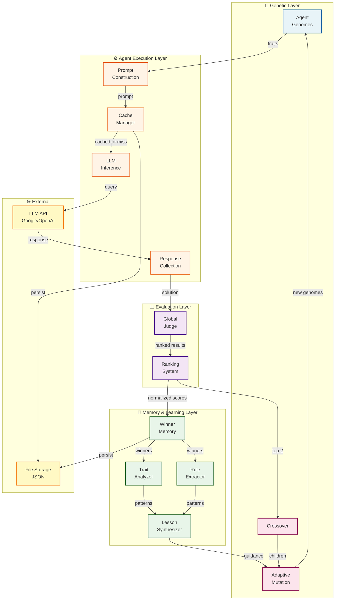
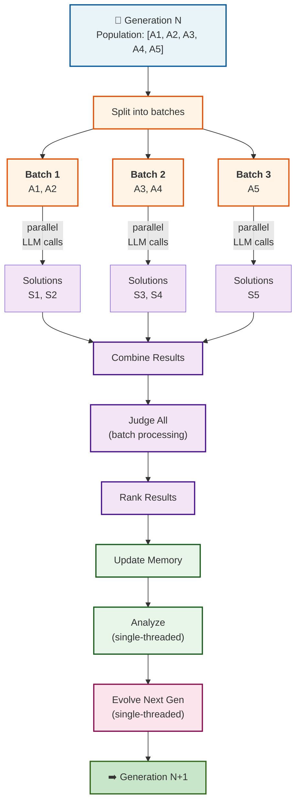
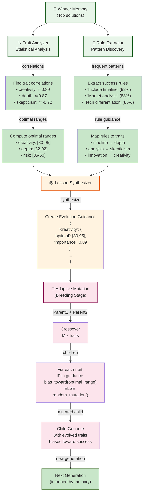
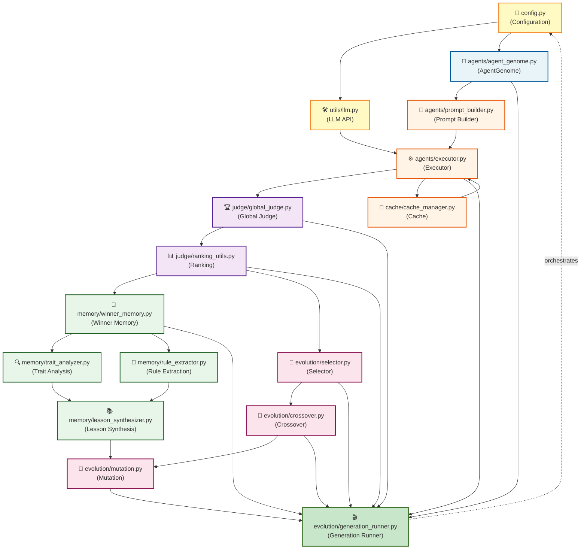
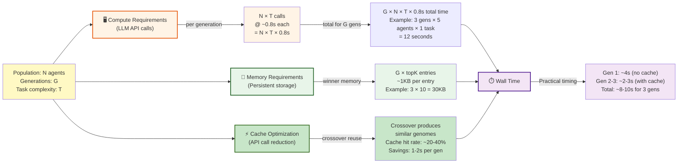

# Agent Darwin - Visual Architecture Guide

Comprehensive Mermaid diagrams showing the system architecture from multiple perspectives.

---

## 1. Complete Generation Cycle Flow

**The end-to-end pipeline for one generation:**

```mermaid
graph TD
    START[("🎬 START GENERATION")]
    
    START --> INIT["Initialize Population"]
    INIT --> GEN["<b>STAGE 1: GENERATION</b><br/>🧬 Create N random agents<br/>with diverse trait values"]
    
    GEN --> BUILD["<b>STAGE 2: BUILD PROMPTS</b><br/>🎨 Convert genome traits<br/>into LLM instructions<br/>(creativity → explore,<br/>depth → analyze, etc.)"]
    
    BUILD --> EXEC["<b>STAGE 3: AGENT EXECUTION LAYER</b><br/>🤖 Prompt Construction → LLM Inference<br/>→ Response Collection"]
    
    EXEC --> CHECK_CACHE{"Cache<br/>Hit?"}
    CHECK_CACHE -->|Yes| CACHED["Use cached solution"]
    CHECK_CACHE -->|No| API["Call LLM API<br/>Cache result"]
    CACHED --> JUDGE
    API --> JUDGE
    
    JUDGE["<b>STAGE 4: EVALUATE</b><br/>🏆 Global Judge scores solutions<br/>on 4 criteria:<br/>• Novelty<br/>• Feasibility<br/>• Completeness<br/>• Clarity"]
    
    JUDGE --> RANK["<b>STAGE 5: RANK</b><br/>📊 Normalize scores<br/>Assign ranks 1-N<br/>Compute percentiles"]
    
    RANK --> STORE["<b>STAGE 6: STORE WINNERS</b><br/>💾 Save top solutions to<br/>Winner Memory (JSON)<br/>Persist genome + score"]
    
    STORE --> ANALYZE["<b>STAGE 7: ANALYZE</b><br/>🔍 Trait Analyzer finds patterns:<br/>• Which traits = high scores?<br/>• Optimal ranges?<br/>• Correlations?"]
    
    ANALYZE --> EXTRACT["<b>STAGE 8: EXTRACT RULES</b><br/>📜 Rule Extractor discovers:<br/>• Success patterns<br/>• Frequency analysis<br/>• Confidence scoring"]
    
    EXTRACT --> SYNTHESIZE["<b>STAGE 9: SYNTHESIZE</b><br/>📚 Combine patterns into<br/>actionable evolution guidance"]
    
    SYNTHESIZE --> SELECT["<b>STAGE 10: SELECT</b><br/>👥 Choose top 2 survivors<br/>as breeding parents"]
    
    SELECT --> CROSS["<b>STAGE 11: CROSSOVER</b><br/>🔀 Mix parent traits<br/>Create 3 children<br/>via genetic recombination"]
    
    CROSS --> MUTATE["<b>STAGE 12: ADAPTIVE MUTATION</b><br/>🧬 Mutate children traits<br/>GUIDED by learned patterns<br/>Not random!"]
    
    MUTATE --> COMBINE["<b>STAGE 13: NEW POPULATION</b><br/>📋 Combine: [Parent1, Parent2,<br/>Child1, Child2, Child3]"]
    
    COMBINE --> LOOP{More<br/>Gens?}
    LOOP -->|Yes| GEN
    LOOP -->|No| END[("✅ EVOLUTION COMPLETE")]
    
    style START fill:#c8e6c9
    style GEN fill:#e8f4f8
    style BUILD fill:#fff4e6
    style EXEC fill:#fff4e6
    style CACHED fill:#c8e6c9
    style API fill:#fbe9e7
    style JUDGE fill:#f3e5f5
    style RANK fill:#f3e5f5
    style STORE fill:#e8f5e9
    style ANALYZE fill:#e8f5e9
    style EXTRACT fill:#e8f5e9
    style SYNTHESIZE fill:#fff3e0
    style SELECT fill:#fce4ec
    style CROSS fill:#fce4ec
    style MUTATE fill:#fce4ec
    style COMBINE fill:#c8e6c9
    style END fill:#81c784
```

---

## 2. Component Interaction Architecture

**How major components communicate:**

---

## 3. Data Flow Perspective

**Information flowing through the system:**

```mermaid
graph LR
    TASK["📋 Task Definition"]
    
    TASK -->|"task context"| GEN["Generate<br/>Population"]
    
    GEN -->|"agents: AgentGenome[]"| BUILD["Build<br/>Prompts"]
    
    BUILD -->|"prompts: string[]"| EXEC["Agent<br/>Execution<br/>Layer"]
    
    EXEC -->|"solutions: Result[]<br/>{agent, solution}"| JUDGE["Judge<br/>Solutions"]
    
    JUDGE -->|"judged: JudgeResult[]<br/>{score, rank, eval}"| RANK["Ranking<br/>System"]
    
    RANK -->|"normalized: RankedResult[]<br/>{agent, score, rank}"| MEMORY["Update<br/>Memory"]
    
    MEMORY -->|"winners: WinnerEntry[]"| ANALYZE["Analyze<br/>Patterns"]
    
    ANALYZE -->|"patterns: TraitAnalysis<br/>rules: Rule[]"| SYNTHESIZE["Synthesize<br/>Lessons"]
    
    SYNTHESIZE -->|"guidance: LessonGuidance<br/>{traits, rules}"| SELECT["Select<br/>Parents"]
    
    SELECT -->|"parents: AgentGenome[]"| CROSS["Crossover"]
    
    CROSS -->|"children: AgentGenome[]"| MUTATE["Adaptive<br/>Mutation"]
    
    MUTATE -->|"mutated: AgentGenome[]<br/>informed by guidance"| NEXT["➡️ Next<br/>Generation"]
    
    NEXT -.->|"feedback loop"| BUILD
    
    style TASK fill:#fff9c4
    style GEN fill:#e8f4f8
    style BUILD fill:#fff4e6
    style EXEC fill:#fff4e6
    style JUDGE fill:#f3e5f5
    style RANK fill:#f3e5f5
    style MEMORY fill:#e8f5e9
    style ANALYZE fill:#e8f5e9
    style SYNTHESIZE fill:#fff3e0
    style SELECT fill:#fce4ec
    style CROSS fill:#fce4ec
    style MUTATE fill:#fce4ec
    style NEXT fill:#c8e6c9
```

---

## 4. Parallel Execution Model

**How generations can be parallelized:**

---

## 5. Adaptive Mutation Deep Dive

**How learned patterns guide evolution:**

---

## 6. Module Dependency Graph

**System module dependencies and imports:**

---

## 7. Quick Reference: Color Coding

Used consistently across all diagrams:

| Color | Layer | Components |
|-------|-------|-----------|
| 🔵 Blue (`#e8f4f8`) | **Genetic** | Genomes, Generation |
| 🟠 Orange (`#fff4e6`) | **Execution** | Prompts, Executor, Cache |
| 🟣 Purple (`#f3e5f5`) | **Evaluation** | Judge, Ranking |
| 🟢 Green (`#e8f5e9`) | **Memory/Learning** | Winner Memory, Analysis, Rules |
| 🟡 Yellow (`#fff3e0`) | **Synthesis** | Lesson Synthesis |
| 🔴 Red (`#fce4ec`) | **Evolution** | Selection, Crossover, Mutation |
| ✅ Light Green (`#c8e6c9`) | **Output/Complete** | Next generation, Results |

---

## 8. Scaling Architecture

**How the system scales with population and generations:**

---

*All diagrams are GitHub-compatible Mermaid syntax. Copy any diagram into a `.md` file for instant rendering in GitHub.*

**Last Updated**: June 3, 2026  
**Mermaid Version**: 10.0+
